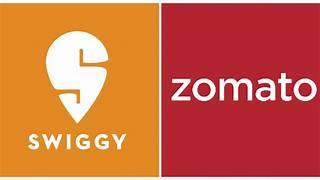

<!DOCTYPE html>
<html lang="en">
<head>
  <meta charset="UTF-8" />
  <meta name="viewport" content="width=device-width, initial-scale=1.0"/>
  <title>Swiggy Clone – Top Section</title>
  <link rel="stylesheet" href="styles.css" />
</head>
<body>
  <header class="navbar">
    

      
      <nav class="nav-links">
        <a href="#">Login</a>
        <a href="#" class="signup-btn">Sign Up</a>
      </nav>
    

  </header>

  <section class="hero">
    

      

        <h1>Hungry?</h1>
        
Order food from your favorite restaurants near you.

        <form class="location-form">
          <input type="text" placeholder="Enter your delivery location" />
          <button type="submit">Find Food</button>
        </form>
      

      

        
      

    

    * {
  margin: 0;
  padding: 0;
  box-sizing: border-box;
}

body {
  font-family: 'Segoe UI', sans-serif;
  background-color: #fc8019;
  color: #fff;
}

.container {
  width: 90%;
  max-width: 1200px;
  margin: auto;
}

.navbar {
  padding: 20px 0;
}

.navbar .container {
  display: flex;
  justify-content: space-between;
  align-items: center;
}

.logo {
  height: 40px;
  filter: brightness(0) invert(1);
}

.nav-links a {
  margin-left: 20px;
  text-decoration: none;
  color: #fff;
  font-weight: 500;
  transition: color 0.3s ease;
}

.nav-links a:hover {
  color: #ffe0c2;
}

.signup-btn {
  background-color: #fff;
  color: #fc8019;
  padding: 8px 16px;
  border-radius: 4px;
  font-weight: bold;
  transition: background 0.3s ease;
}

.signup-btn:hover {
  background-color: #ffe0c2;
}

.hero {
  padding: 80px 0;
}

.hero-content {
  display: flex;
  flex-wrap: wrap;
  align-items: center;
  justify-content: space-between;
}

.hero-text {
  flex: 1;
  min-width: 300px;
  animation: fadeInLeft 1s ease;
}

.hero-text h1 {
  font-size: 56px;
  margin-bottom: 10px;
}

.hero-text p {
  font-size: 20px;
  margin-bottom: 30px;
}

.location-form {
  display: flex;
  max-width: 500px;
}

.location-form input {
  flex: 1;
  padding: 14px;
  border: none;
  border-radius: 4px 0 0 4px;
  font-size: 16px;
}

.location-form button {
  padding: 14px 20px;
  background-color: #fff;
  color: #fc8019;
  border: none;
  border-radius: 0 4px 4px 0;
  font-size: 16px;
  font-weight: bold;
  cursor: pointer;
  transition: background 0.3s ease;
}

.location-form button:hover {
  background-color: #ffe0c2;
}

.hero-image {
  flex: 1;
  text-align: center;
  min-width: 300px;
  animation: fadeInRight 1s ease;
}

.hero-image img {
  max-width: 100%;
  height: auto;
  border-radius: 12px;
}

/* Animations */
@keyframes fadeInLeft {
  from { opacity: 0; transform: translateX(-30px); }
  to { opacity: 1; transform: translateX(0); }
}

@keyframes fadeInRight {
  from { opacity: 0; transform: translateX(30px); }
  to { opacity: 1; transform: translateX(0); }
}

/* Responsive */
@media (max-width: 768px) {
  .hero-content {
    flex-direction: column;
    text-align: center;
  }

  .location-form {
    flex-direction: column;
  }

  .location-form input,
  .location-form button {
    width: 100%;
    border-radius: 4px;
    margin-bottom: 10px;
  }
}
.signup-btn {
  background-color: #28a745; /* new background color */
  color: #ffffff;            /* new text color */
  padding: 8px 16px;
  border-radius: 4px;
  font-weight: bold;
  border: none;              /* ensure no border overrides */
  transition: background 0.3s ease;
}

.signup-btn:hover {
  background-color: #218838; /* darker green on hover */
}

  </section>
</body>
</html>           
